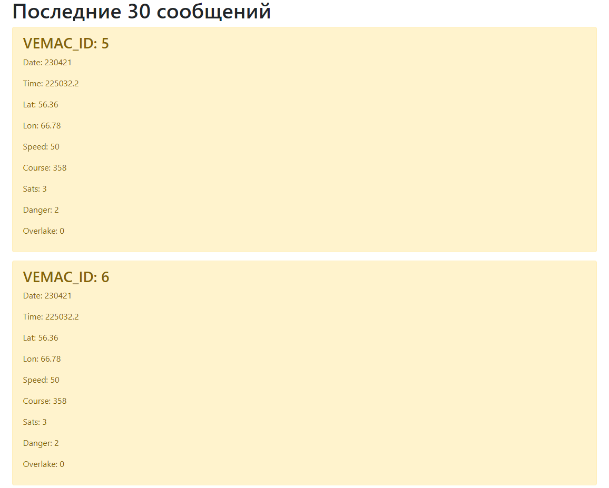

# Телеметрия от гоночных автомобилей
:car: Веб-сервис, принимающий данные телеметрии от гоночных автомобилей, такие как: координата автомобиля, в котором установлено это устройство, скорость движения, направление движения и так далее. Информация передаётся с помощью API, где в теле POST запроса указывается необходимая информация. Веб-сервис принимает эту информацию и сохраняет её в базе данных. Также веб-сервис имеет страницу, на которой выводятся последние принятые 30 сообщений.

____
## Пример вывода сообщений
  

Указываются следующие параметры:
- Date - дата в формате DDMMYY
- Time - время в формате HHMMSS.m (с точностью до 0,1 с)
- Lat - широта в градусах
- Lon - долгота в градусах
- Speed - скорость, целое число в км/ч
- Course - курс, целое число от 0 до 359 в градусах
- Sats - количество принимаемых спутников
- Danger - принимает значения 0, 1 (SOS), 2 (OK)
- Overtake - 0 или 1 (фиксируется сообщение с запросом обгона)

Параметры передаются запросом типа POST, в URL указывается ID устройства

`POST api/123` – пример для устройства с ID 123

Сообщения хранятся в базе данных SQLite, на странице выводятся последний 30 сообщений.

Вы можете запустить этот проект локально, выполнив следующие команды:

- Скопируйте данный репозиторий командой `git clone https://github.com/RomanMRR/gsm_accepte.git`
- `cd gsm_accepte`
- `python manage.py runserver`

Также вы можете запустить проект при помощи Docker командой:
`docker-compose up -d`
